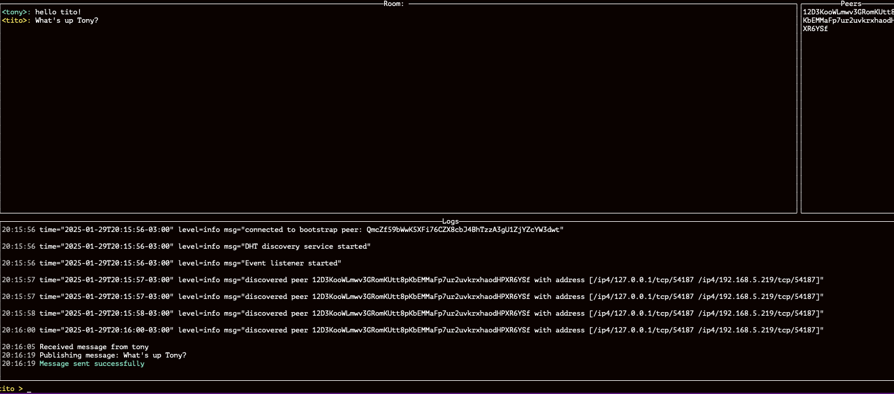

# 🌐 LibP2P Showcase: A Decentralized Chat Application

A proof-of-concept application demonstrating core libp2p concepts through a decentralized chat interface. This project showcases peer discovery mechanisms, pubsub patterns, and real-time network monitoring in a practical P2P environment.



## 🎯 Project Overview

This application serves as a practical demonstration of key libp2p features:
- Hybrid peer discovery (mDNS + Kademlia DHT)
- PubSub messaging patterns
- Real-time network event monitoring
- P2P connection management
- Protocol negotiation

## 🔬 Technical Architecture

### Peer Discovery Implementation

#### Local Network Discovery (mDNS)
- Uses multicast DNS for zero-configuration networking
- Automatic peer discovery within the same LAN
- Implementation of the mDNS discovery service interface
- Configurable retry mechanisms and connection handling
```go
type MDNSDiscovery struct {
    host      host.Host
    peerChan  chan peer.AddrInfo
    // ... other fields
}
```

#### Global Network Discovery (Kademlia DHT)
- Distributed Hash Table based on Kademlia protocol
- Provides decentralized peer discovery across the internet
- Uses bootstrap nodes for initial network joining
- Implements key-based routing with XOR metric
```go
type DHTDiscovery struct {
    dht       *dht.IpfsDHT
    discovery *routing.RoutingDiscovery
    // ... other fields
}
```

### PubSub Messaging
- Built on libp2p's GossipSub protocol
- Topic-based message routing
- Automatic peer discovery and mesh formation
- Configurable message validation and scoring

### Real-Time Network Monitoring
- Event-driven architecture tracking network state
- Monitored events include:
  - Peer connections/disconnections
  - Protocol negotiations
  - NAT traversal status
  - Local/remote address updates
  - Peer identification lifecycle

## 📊 Performance Metrics

The application provides real-time monitoring of:
```go
// Metrics updated every 60 seconds
- Bandwidth usage (in/out rates)
- PubSub-specific bandwidth
- Connected peers count
- Active protocols
- Memory utilization
```

## 🚀 Getting Started

### Installation
```bash
git clone https://github.com/alejoacosta74/p2p-chat
cd p2p-chat
go build
```

### Command-Line Options
```bash
Usage: p2p-chat [flags]

Flags:
  -n, --nickname string   Nickname for chat (default "anonymous")
  -r, --room string      Chat room name (default "default")
  -l, --log string       Log level [debug|info|warn|error] (default "info")
  -f, --logfile string   Log file name (default "chat.log")
```

### Debug Mode
Start with debug logging to see detailed libp2p events:
```bash
./p2p-chat --log debug
```
This enables the real-time event panel showing:
- Protocol negotiations
- Peer discovery events
- Connection state changes
- NAT traversal updates
- DHT operations

## 🖥️ User Interface

### Multi-Panel Terminal UI
1. **Message Area**: Chat messages with colored nicknames
2. **Peer List**: Active participants in current room
3. **Event Log Panel**: Real-time libp2p events and metrics
4. **Input Field**: Message composition with commands

### Debug Panel Features
- Real-time libp2p event streaming
- Network metrics updates
- Protocol negotiation logs
- Peer discovery events
- Connection state changes

## 🔜 Technical Roadmap

### Network Improvements
- [ ] Custom peer scoring implementation
- [ ] Advanced DHT configuration options
- [ ] Alternative transport protocols (QUIC, WebRTC)
- [ ] Custom protocol handlers

### Monitoring Enhancements
- [ ] Custom event subscribers
- [ ] Performance profiling tools

### Security Features
- [ ] Noise protocol integration
- [ ] Custom PubSub message validation
- [ ] Peer authentication mechanisms
- [ ] Rate limiting implementation

## 🛠️ Development

This project serves as a learning tool for understanding:
- P2P network architecture
- Distributed systems concepts
- libp2p protocol stack
- Network event handling
- Decentralized discovery mechanisms

## 📚 References

- [libp2p Documentation](https://docs.libp2p.io/)
- [Kademlia DHT Paper](https://pdos.csail.mit.edu/~petar/papers/maymounkov-kademlia-lncs.pdf)
- [GossipSub Specification](https://github.com/libp2p/specs/blob/master/pubsub/gossipsub/gossipsub-v1.0.md)
- [mDNS RFC](https://datatracker.ietf.org/doc/html/rfc6762)

## 📜 License

MIT License - see [LICENSE](LICENSE)

---

<p align="center">
Built with libp2p | UI powered by tview
</p>